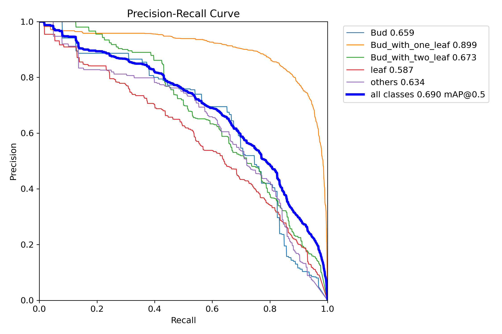

# YOLOv12 for Tea Bud Detection

## Datasets
**We constructed the tea dataset with a total of ? images, of which the training set? images, test set? images, validation set? images. The dataset contains five classes: `0: Bud`, `1: Bud_with_one_leaf`, `2: Bud_with_two_leaf`, `3: leaf`, and `4: others` (can't classify the target from 0 to 3), and the corresponding examples are shown in Figure 1. Figure 2 gives the statistics of the number of different classes in the dataset.**

<p align="center">
   <br>
  Figure 1. Examples of five classes 
</p>

<p align="center">
   <br>
  Figure 2. Statistics on the number of different classes
</p>

**We give [TeaBud Datasets](https://huggingface.co/datasets/IDIP-Lab/TeaBudSort_Dataset/tree/main) in coco format and ultralytics format respectively. The files are arranged as follows:**
* **ultralytics dataset**
```
|—train
|    |—images
|    |    |—Image_xxx.jpg
|    |—labels
|    |    |—Image_xxx.txt
|
|—test
|    |—images
|    |    |—Image_yyy.jpg
|    |—labels
|    |    |—Image_yyy.txt
|
|—val
|    |—images
|    |    |—Image_zzz.jpg
|    |—labels
|    |    |—Image_zzz.txt
|
```
* **coco dataset**
```
|—train
|    |—Image_xxx.jpg
|
|—test
|    |—Image_yyy.jpg
|
|—val
|    |—Image_zzz.jpg
|
|—annotations
|    |—train.json
|    |—test.json
|    |—val.json
```
**Current models only support the ultralytics dataset, the coco version comes later. To run our model, please download ultralytics dataset first and place dataset to the folder `../datasets/`.**

## Main Results
**We did three comparison experiments using `1:original model + original image`, `2:using ATFL loss + original image`, and `3:original model + image with the surrounding black edges cut`. The PR-curve of three experiments are as follows:**
<p align="center">
     <br>
  Figure 3. PR-curve of three experiments
</p>

## Installation
```
wget https://github.com/Dao-AILab/flash-attention/releases/download/v2.7.3/flash_attn-2.7.3+cu11torch2.2cxx11abiFALSE-cp311-cp311-linux_x86_64.whl
conda create -n yolov12 python=3.11
conda activate yolov12
pip install -r requirements.txt
pip install -e .
```

## Training 
* **Download [yolov12x](https://huggingface.co/IDIP-Lab/TeaBudSort/tree/main), and run** `train.py` **or following code to perform network training:**
```python
from ultralytics import YOLO

# load a model
model = YOLO('yolov12x.yaml')
model.load("yolov12x.pt")

# Train the model
results = model.train(
  data='tea.yaml',
  epochs=300,
  batch=16,
  imgsz=640,
  scale=0.9,  # S:0.9; M:0.9; L:0.9; X:0.9
  mosaic=1.0,
  mixup=0.2,  # S:0.05; M:0.15; L:0.15; X:0.2
  copy_paste=0.6,  # S:0.15; M:0.4; L:0.5; X:0.6
  device="cuda:0",
)
```

## Validation

* **Download [best.pt](https://huggingface.co/IDIP-Lab/TeaBudSort/tree/main) or use your training parameter, and run** `val.py` **or following code to validation:**

```python
from ultralytics import YOLO

model = YOLO('best.pt')
model.val(data='tea.yaml', save_json=True)
```

## Export
* **Run** `export.py` **or following code to export onnx file:**
```python
from ultralytics import YOLO

model = YOLO('yolov12x.yaml')
model.load("best.pt")

model.export(
    format="onnx",
    dynamic=True,
    opset=12,
    imgsz=(640,640)
)
```

## Acknowledgement

This code is sourced from [yolov12](https://github.com/sunsmarterjie/yolov12). Thanks for their excellent work!


